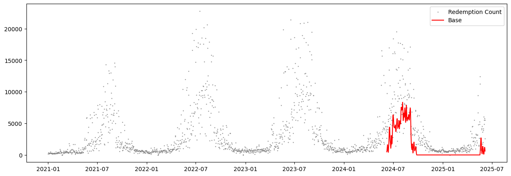
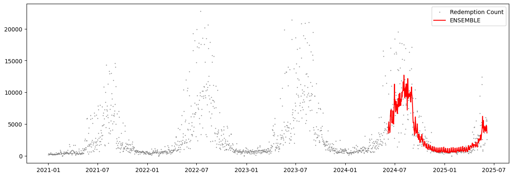
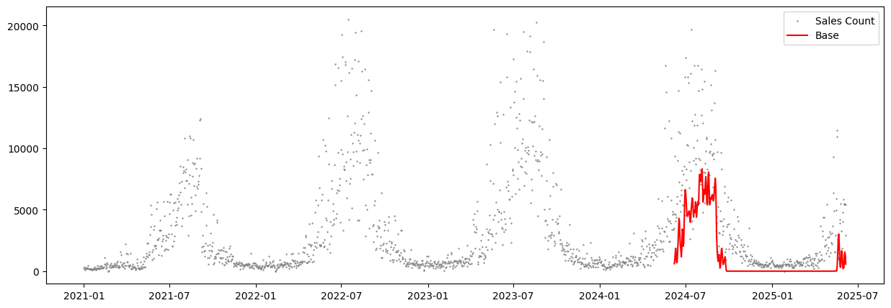
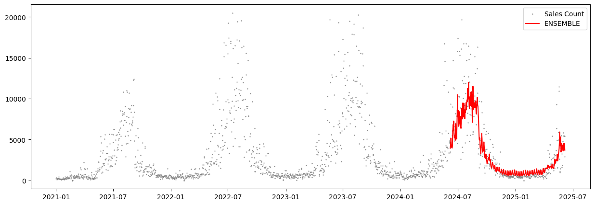

# Technical Test for Applied Scientist (Data Scientist)

__Opportunity No. 44081__

## Executive Summary (Accessible description) (200 words)
* The project aimed to improve forecasting of a daily ferry ticket redemptions base model and create a new forecast model for daily ticket sales, using a 365-day forecast window.
* Six different models were tested, including simple averages, traditional time series models such as ARIMAX and SARIMAX, and Prophet, a forecasting tool developed by Meta. The best results came from combining several models in an ensemble.
* The data showed strong seasonal patterns, with higher ticket sales during warmer months.
* The ensemble approach reduced forecasting errors by about 39 percent compared to the original baseline model.
* The long forecast horizon limits the use of some variables, such as weather, since future values are unknown at prediction time. For example, a model can be built to leverage weather data, but future weather is not available when forecasting the next year of sales.
* In this context of a long forecasting window and limited variables, simpler and more interpretable models such as SARIMAX outperformed more advanced tools like Prophet.
* Future improvements could include incorporating known-in-advance calendar data such as holidays and school breaks, exploring other state-of-the-art models such as LSTM or Transformers, and estimating uncertainty to support better decision-making.
* The full report is available at the end of this README.


## Installation and Execution:

```
# Create a Python Virtual Environment and activate it (Recommended)
python -m venv myenv
source myenv/bin/activate

# Install dependencies in Environment
pip install -r requirements.txt

```

* Run the notebooks to explore each component of the project:
    * [`Modelling.ipynb`](https://github.com/mmaisonnave/forecasting-ferry-traffic-toronto/blob/main/Modelling.ipynb): Runs redemption forecasting models.
    * [`Sales_Modelling.ipynb`](https://github.com/mmaisonnave/forecasting-ferry-traffic-toronto/blob/main/Sales_Modelling.ipynb): Runs sales forecasting models.
    * [`exploratory-data-analysis.ipynb`](https://github.com/mmaisonnave/forecasting-ferry-traffic-toronto/blob/main/exploratory-data-analysis.ipynb): Contains data exploration and visualizations.

* The [`Model.py`](https://github.com/mmaisonnave/forecasting-ferry-traffic-toronto/blob/main/Model.py) module defines a forecasting class used across both modeling notebooks. It supports using one time series as an exogenous regressor for the other.
* Original datasets and results are available in the [`data/`](https://github.com/mmaisonnave/forecasting-ferry-traffic-toronto/tree/main/data) directory.

## Demo forecasting: 

### Redemptions Forecasting models for the fourth train/test split: base vs best model (ensemble)





See the plots for the other models in notebook: [`Modelling.ipynb`](https://github.com/mmaisonnave/forecasting-ferry-traffic-toronto/blob/main/Modelling.ipynb). 

### Sales Forecasting models for the fourth train/test split: base vs best model (ensemble)






See the plots for the other models in notebook: [`Sales_Modelling.ipynb`](https://github.com/mmaisonnave/forecasting-ferry-traffic-toronto/blob/main/Sales_Modelling.ipynb). 


## Full Report (500 words)

### 1. Task

This project tackles a forecasting task using the [Toronto Island Ferry Ticket dataset](https://open.toronto.ca/dataset/toronto-island-ferry-ticket-counts/), with two objectives: (1) improve a base model for predicting daily ticket redemptions, and (2) build a new model to forecast daily ticket sales. A 365-day forecast horizon is used, as defined in the base model, limiting the use of future exogenous variables (such as weather), which are unreliable when forecasting that far ahead. Models relied on historical patterns to capture strong seasonality. Calendar features (holidays, school breaks) were excluded but noted for future work.

### 2. Data
The original dataset records ferry ticket sales and redemptions at 15-minute intervals. As done with the base model, this data was aggregated to daily frequency, producing two daily time series: sales and redemption counts.

The series exhibit strong seasonal patterns, peaking during warmer months. Model performance was evaluated using an expanding window with four train/test splits, where each training set grew incrementally and the subsequent 365 days served as unseen test data. To prevent data leakage and ensure realistic forecasting, only features available at training time were used, with test data reserved strictly for evaluation, assuming no knowledge of future exogenous variables.

### 3. Models

Six forecasting models were implemented for both target variables:

* Historical Average by Day: A simple benchmark using daily averages from the training set as predictions.
* ARIMA-based Models (ARIMAX, ARIMAX on Residuals, SARIMAX): Autoregressive models with exogenous inputs. To forecast one target (sales or redemptions), the other was used as a regressor. Since future values were unavailable for the 365-day test period, test-time regressors were replaced with historical daily averages from the training set. ARIMAX on Residuals was applied after removing seasonality; the seasonal component for the test set was estimated using the Base Model and added back to create the final forecasts. SARIMAX extended ARIMAX by incorporating seasonal terms.
* Prophet: A forecasting tool developed by Meta that fits non-linear trends with additive yearly, weekly, and daily seasonality.
* Ensemble: An average of forecasts from ARIMAX, SARIMAX, Prophet, and the Historical Average. ARIMAX on Residuals was excluded due to reduced performance.

Hyperparameters were tuned using greedy search, guided by exploratory techniques such as stationarity checks (ADF), decomposition (STL), and autocorrelation analysis (ACF/PACF), see Exploratory Data Analysis notebook.

### 4. Results

The ensemble model delivered the best performance in both tasks. Performance was measured using Mean Absolute Error ([MAE](https://en.wikipedia.org/wiki/Mean_absolute_error)), Mean Squared Error ([MSE](https://en.wikipedia.org/wiki/Mean_squared_error)), and Mean Absolute Percentage Error ([MAPE](https://en.wikipedia.org/wiki/Mean_absolute_percentage_error)) on the 365-day test horizon averaged over four splits.

**Redemption Forecasting Models:**

| Metric   | Model    | Mean           | Std Dev        | 95% Confidence Interval             |
|----------|----------|----------------|----------------|-------------------------------------|
| **MAPE** | Base     | 0.8652         | 0.0194         | [0.8344, 0.8961]                    |
|          | Ensemble | 0.5919         | 0.1834         | [0.3000, 0.8838]                    |
| **MAE**  | Base     | 2,468.64       | 515.08         | [1,649.03, 3,288.26]                |
|          | Ensemble | 1,496.95       | 104.98         | [1,329.91, 1,663.99]                |
| **MSE**  | Base     | 14,659,607.33  | 5,655,109.52   | [5,661,066.13, 23,658,148.54]       |
|          | Ensemble | 7,053,227.89   | 2,297,804.76   | [3,396,907.76, 10,709,548.03]       |


**Sales Forecasting Models:**

| Metric   | Model    | Mean          | Std Dev      | 95% Confidence Interval       |
| -------- | -------- | ------------- | ------------ | ----------------------------- |
| **MAPE** | Base     | 0.8411        | 0.0170       | [0.8139, 0.8682]              |
|          | Ensemble | 0.8841        | 0.1675       | [0.6175, 1.1507]              |
| **MAE**  | Base     | 2,326.43      | 591.40       | [1,385.39, 3,267.47]          |
|          | Ensemble | 1,403.18      | 200.44       | [1,084.24, 1,722.13]          |
| **MSE**  | Base     | 12,792,470.29 | 5,660,765.93 | [3,784,928.48, 21,800,012.10] |
|          | Ensemble | 5,982,077.00  | 2,466,846.79 | [2,056,773.27, 9,907,380.73]  |

All results [here](https://github.com/mmaisonnave/forecasting-ferry-traffic-toronto/blob/main/data/all_formatted_results.txt).


### 5. Conclusions and Future Work
The experiments produced effective models for both tasks. Simple interpretable models like SARIMAX outperformed advanced ones like Prophet, showing that in long forecasting windows with limited features, simpler methods suffice. A simple ensemble achieved the best results, cutting MAE by ~39% for sales and redemption forecasting. Future work could include known events (e.g., holidays), explore neural models (LSTMs, Transformers), and adopt probabilistic forecasting for uncertainty quantification.